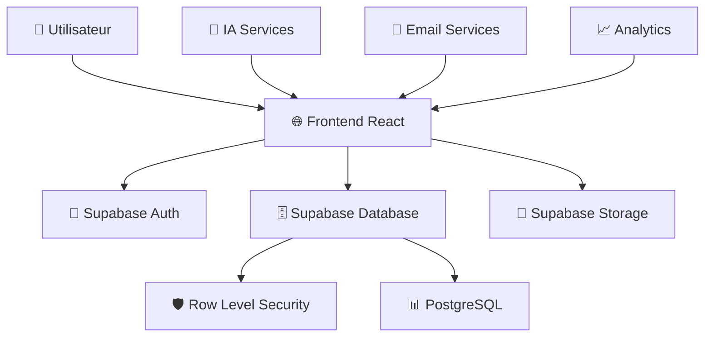

# 🏗️ Architecture Technique - Emploi Romand

## 📊 Vue d'Ensemble



## 🎯 Stack Technique Détaillé

### 🖥️ Frontend
```typescript
// Technologies principales
React 18.3.1          // Framework UI
TypeScript 5.5.3      // Typage statique
Vite 5.4.1            // Build tool moderne
Tailwind CSS 3.4.11   // Framework CSS utilitaire
shadcn/ui             // Composants UI premium

// Librairies spécialisées
React Router 6.26.2   // Routing SPA
React Hook Form 7.53.0 // Gestion des formulaires
@hello-pangea/dnd     // Drag & drop Kanban
Recharts 2.12.7       // Graphiques et analytics
Lucide React 0.462.0  // Icônes modernes
```

### 🗄️ Backend (Supabase)
```sql
-- Base de données PostgreSQL 15+
-- Row Level Security (RLS) activé
-- Authentification JWT intégrée
-- Storage pour fichiers utilisateur
-- Edge Functions pour logique métier
```

### 🔧 Outils de Développement
```json
{
  "linting": "ESLint 9.9.0",
  "formatting": "Prettier 3.3.3",
  "testing": "Vitest 1.6.0",
  "ci_cd": "GitHub Actions",
  "deployment": "Vercel/Netlify"
}
```

## 🏛️ Architecture des Composants

### 📱 Structure Hiérarchique
```
App.tsx (Root)
├── AuthProvider (Context)
├── Layout.tsx
│   ├── Header.tsx
│   ├── Sidebar.tsx
│   └── Main Content
│       ├── LandingPage.tsx
│       ├── DashboardPage.tsx
│       ├── JobSearchPage.tsx
│       ├── ApplicationsPage.tsx (Kanban)
│       ├── RiasecTestPage.tsx
│       ├── EnneagramTestPage.tsx
│       ├── InterviewPreparationPage.tsx
│       └── ProfilePage.tsx
└── UI Components (shadcn/ui)
```

### 🔄 Flux de Données
```typescript
// Pattern de gestion d'état
User Action → Component → Hook → Supabase Client → Database
                ↓
         Context Update → Re-render → UI Update
```

## 🗄️ Schéma de Base de Données

### 📋 Tables Principales
```sql
-- Authentification et profils
auth.users                    -- Supabase Auth (intégré)
user_profiles                 -- Profils utilisateurs étendus

-- Données de référence Suisse
cantons_2025_10_03_16_01     -- 6 cantons romands
communes_2025_10_03_16_01    -- Communes par canton
sectors_2025_10_03_16_01     -- Classification NOGA

-- Emplois et candidatures
job_offers_2025_10_03_16_01  -- Offres d'emploi
applications_2025_10_03_16_01 -- Candidatures (statuts Kanban)

-- Tests psychométriques
riasec_tests_2025_10_03_16_01    -- Questions RIASEC
riasec_results_2025_10_03_16_01  -- Résultats utilisateurs
enneagram_tests_2025_10_03_16_01 -- Questions Ennéagramme
enneagram_results_2025_10_03_16_01 -- Résultats utilisateurs

-- Système
user_documents_2025_10_03_16_01  -- CV, lettres, etc.
interview_resources_2025_10_03_16_01 -- Ressources préparation
notifications_2025_10_03_16_01   -- Notifications utilisateur
activity_log_2025_10_03_16_01    -- Logs d'activité
```

### 🛡️ Sécurité RLS
```sql
-- Exemple de politique RLS
CREATE POLICY "Users can view own applications" 
ON applications_2025_10_03_16_01
FOR SELECT USING (auth.uid() = user_id);

CREATE POLICY "Users can insert own applications"
ON applications_2025_10_03_16_01  
FOR INSERT WITH CHECK (auth.uid() = user_id);
```

## 🎨 Design System

### 🎨 Palette de Couleurs
```css
:root {
  /* Couleurs principales */
  --primary: 213 88% 59%;        /* Bleu professionnel suisse */
  --primary-glow: 213 88% 70%;   /* Bleu lumineux */
  --secondary: 24 95% 53%;       /* Orange moderne */
  --accent: 142 76% 36%;         /* Vert suisse */
  
  /* Couleurs système */
  --background: 0 0% 100%;       /* Blanc pur */
  --foreground: 222.2 84% 4.9%;  /* Gris très foncé */
  --muted: 210 40% 96%;          /* Gris très clair */
  --border: 214.3 31.8% 91.4%;  /* Bordures subtiles */
}
```

### 📐 Système de Grille
```css
/* Breakpoints responsive */
sm: 640px   /* Mobile large */
md: 768px   /* Tablette */
lg: 1024px  /* Desktop */
xl: 1280px  /* Large desktop */
2xl: 1536px /* Extra large */
```

### 🔤 Typographie
```css
/* Hiérarchie typographique */
.text-4xl { font-size: 2.25rem; }  /* Titres principaux */
.text-3xl { font-size: 1.875rem; } /* Sous-titres */
.text-xl { font-size: 1.25rem; }   /* Titres de section */
.text-base { font-size: 1rem; }    /* Texte normal */
.text-sm { font-size: 0.875rem; }  /* Texte secondaire */
```

## 🔐 Architecture de Sécurité

### 🛡️ Couches de Protection
```
1. Frontend Validation    → Validation immédiate UX
2. Network Security      → HTTPS, CORS, CSP headers  
3. Authentication        → JWT tokens, refresh logic
4. Authorization         → RLS policies, permissions
5. Database Security     → Encrypted storage, backups
```

### 🔑 Authentification Flow
```typescript
// Flux d'authentification
1. User Login → Supabase Auth
2. JWT Token Generated → Stored securely
3. RLS Policies Applied → Database access
4. Session Management → Auto-refresh tokens
5. Logout → Token invalidation
```

## 📊 Performance & Optimisation

### ⚡ Optimisations Frontend
```typescript
// Code splitting par route
const Dashboard = lazy(() => import('./pages/Dashboard'));
const JobSearch = lazy(() => import('./pages/JobSearch'));

// Optimisation des requêtes
const { data, isLoading } = useQuery({
  queryKey: ['jobs', filters],
  queryFn: () => fetchJobs(filters),
  staleTime: 5 * 60 * 1000, // 5 minutes cache
});
```

### 🗄️ Optimisations Database
```sql
-- Index pour performances
CREATE INDEX idx_job_offers_canton ON job_offers_2025_10_03_16_01(canton_id);
CREATE INDEX idx_applications_user ON applications_2025_10_03_16_01(user_id);
CREATE INDEX idx_applications_status ON applications_2025_10_03_16_01(status);
```

## 🚀 Déploiement & CI/CD

### 🔄 Pipeline Automatisé
```yaml
# GitHub Actions workflow
Trigger: Push to main
├── 🧪 Tests (Unit, Integration, E2E)
├── 🔍 Security Scan (npm audit, SAST)
├── 🏗️ Build (Vite production build)
├── 📊 Performance Check (Lighthouse)
└── 🚀 Deploy (Vercel/Netlify)
```

### 🌐 Infrastructure
```
CDN (Vercel/Netlify)
├── Static Assets (JS, CSS, Images)
├── Edge Functions (API routes)
└── Global Distribution

Database (Supabase)
├── PostgreSQL (Primary)
├── Read Replicas (Performance)
└── Backups (Automated)
```

## 📈 Monitoring & Analytics

### 📊 Métriques Techniques
```typescript
// Performance Web Vitals
- First Contentful Paint (FCP) < 1.5s
- Largest Contentful Paint (LCP) < 2.5s  
- First Input Delay (FID) < 100ms
- Cumulative Layout Shift (CLS) < 0.1
```

### 🔍 Monitoring Applicatif
```typescript
// Métriques métier
- Taux de conversion inscription
- Temps moyen de recherche d'emploi
- Taux de complétion des tests psychométriques
- Engagement utilisateur (sessions, pages vues)
```

## 🔮 Évolutivité Future

### 📱 Extensions Prévues
```typescript
// Roadmap technique
Q1 2025: React Native App (Mobile)
Q2 2025: AI/ML Integration (Matching avancé)
Q3 2025: Microservices Architecture
Q4 2025: Multi-tenant SaaS Platform
```

### 🔌 Intégrations Futures
```typescript
// APIs tierces planifiées
- LinkedIn API (Import profils)
- Indeed/JobUp API (Agrégation offres)
- Stripe API (Paiements premium)
- Zoom API (Entretiens vidéo)
- N8N Workflows (Automatisation)
```

## 📞 Support Technique

### 🛠️ Outils de Debug
```bash
# Développement local
npm run dev          # Mode développement
npm run build        # Build production
npm run preview      # Test build local
npm run lint         # Vérification code
npm run type-check   # Vérification types
```

### 📋 Troubleshooting
```typescript
// Problèmes courants et solutions
1. Build Errors → Vérifier types TypeScript
2. Auth Issues → Vérifier clés Supabase
3. RLS Errors → Vérifier politiques de sécurité
4. Performance → Analyser bundle size
```

---

**🏗️ Cette architecture est conçue pour être robuste, scalable et maintenable à long terme.**